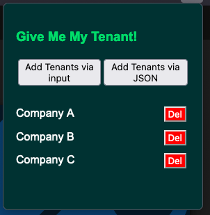

# GiveMeMyTenant
 This is a browser extension that helps with switching tenants in *.microsoft.com portals. This does not work with Azure, as it handles tenant information differently. 

 ## Is this you?
 You are working in one of your customers tenants, and when you are done you switch over to the next customer with the "switch tenant button":
 

 You continue working, but now when you want to change tenant, the button has disappeared!
 
 

 So until the small, indie company, Microsoft has the capacity to fix this bug you can use the "GiveMeMyTenant"-extention!

 ## The Extension
 
 This is a small extension, with the only purpose of changing the current tenant ID (TID). 
 All data is stored locally in the browser, and will persist between reboots. Deleting all browser data might delete saved TIDs. 
 It works on any *.microsoft.com that uses TIDs in URL, and can even switch tenants while you are in submenus in the portal. 